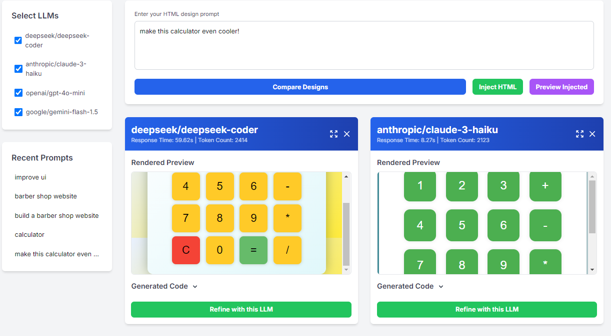

# 🎨 DesignForge AI

DesignForge AI is a powerful tool that allows you to compare and iterate on HTML designs using various Language Models (LLMs). It's perfect for developers and designers who want to explore AI-generated web designs and get a quick and dirty idea of what's possible which several LLMs! 🚀

## 📸 Screenshot



## 🌟 Features

- 🔄 Compare HTML designs generated by different language models
- 💉 Inject existing HTML code for refinement
- 🔍 Refine designs with specific LLMs
- 🖥️ View generated designs in full screen
- 📋 Copy generated code with ease
- 📊 Track response times and token usage

## 🏗️ Project Structure

```
└── designforge_ai
    ├── app.py
    ├── static
    │   ├── app.js
    │   └── index.html
    ├── images
    │   └── designforge_screenshot.png
    ├── .env
    ├── .gitignore
    ├── LICENSE
    ├── requirements.txt
    └── README.md
```

## 🛠️ Setup

1. Clone the repository:
   ```
   git clone https://github.com/yourusername/designforge-ai.git
   cd designforge-ai
   ```

2. Create a virtual environment and activate it:
   ```
   python -m venv venv
   source venv/bin/activate  # On Windows, use `venv\Scripts\activate`
   ```

3. Install dependencies:
   ```
   pip install -r requirements.txt
   ```

4. Create a `.env` file in the root directory and add your OpenRouter API key:
   ```
   OPENROUTER_API_KEY=your_api_key_here
   ```

   📝 **Note:** DesignForge AI currently uses OpenRouter to access various LLMs. You'll need to sign up at [OpenRouter](https://openrouter.ai/) to get an API key. OpenRouter provides access to multiple language models, including those from OpenAI, Anthropic, and others.

## 🚀 Running DesignForge AI

Run the following command in the project root:

```
python app.py
```

Then open your browser and navigate to `http://localhost:5000`. You're all set to start forging AI-generated designs! 🎉

## 💡 How to Use DesignForge AI

1. 🖊️ Enter your HTML design prompt in the text area.
2. ✅ Select the LLMs you want to compare from the list.
3. 🔘 Click "Compare Designs" to generate designs from the selected LLMs.
4. 👀 View the rendered previews and generated code for each LLM.
5. 🔄 Use the "Refine with this LLM" button to iterate on a specific design.
6. 💉 Use the "Inject HTML" feature to start with existing HTML code.

## 🤝 Contributing

Pull requests are welcome! For major changes, please open an issue first to discuss what you would like to change. Some ideas for contributions:

- 🎨 Improve the UI/UX design of DesignForge AI
- 🔧 Add support for more LLMs
- 📊 Enhance the comparison metrics
- 🐛 Fix any bugs you encounter

## 📄 License

This project is licensed under the [MIT License](https://choosealicense.com/licenses/mit/).

## 🙏 Acknowledgements

- Thanks to [OpenRouter](https://openrouter.ai/) for providing access to various LLMs.
- Built with [Flask](https://flask.palletsprojects.com/), [Vue.js](https://vuejs.org/), and [Tailwind CSS](https://tailwindcss.com/).

## ⚠️ Disclaimer

DesignForge AI is for educational and experimental purposes. Always review and test the generated code before using it in production environments. The quality and appropriateness of the generated designs depend on the prompts and the selected LLMs.

---

Happy designing with DesignForge AI! If you find this tool useful, don't forget to give it a star ⭐️ on GitHub!